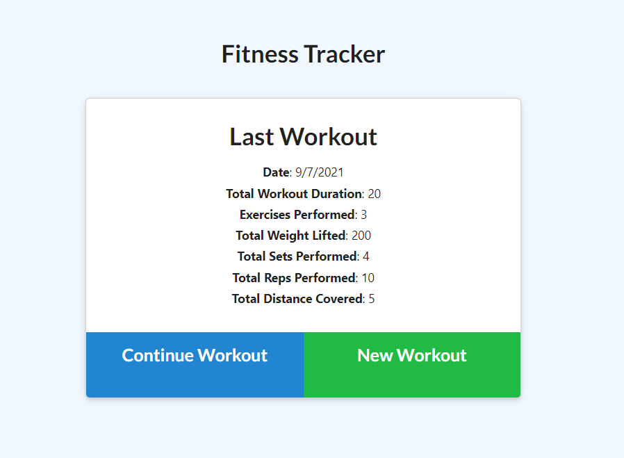

# <Homework Week 18: Workout Tracker>  
  
    

  ## Description  
  ### What was your motivation?  
    - Create a Workout Tracker using NOSQL, incorporating a provided frontend.  
  ### Why did you build this project?  
    - To further develop techniques used to understand routing and modeling NOSQL databases using mongoose.  
  ### What problem does it solve?  
    - As a user, I want to be able to view create and track daily workouts.  I want to be able to log multiple exercises in a workout on a given day.  I should also be able to track the name, type, weight, sets, reps, and duration of exercise.  If the exercise is a cardio exercise, I should be able to track my distance traveled.  
  ### What did you learn making this project?  
    - I learned fundamentals of Mongoose, NoSQL, Morgan, Express, and Chart.js  
   
  ## Table of Contents 
  - [Installation](#installation)  
  - [Usage](#usage)  
  - [Credits](#credits)  
  - [License](#license)  

  ## Installation  
  ### The application will be invoked by using the following command:  
        node server.js    

  ## Usage  
    
      
  ## Credits  
  Contact me at: [email](poo328@my.utsa.edu "email")  
  Github can be found at: [Github](https://github.com/MrG105 "Github")  
    
  ## License
      Licensed under the MIT license  
  ---